# Результаты

### 1. Выполнил команду `npm install` в терминале своего проекта и получил нужные зависимости для полноценного веб-приложения
### 2. Выполнил команду `npm run setup-env` для настройки переменного окружения (скрин ниже)

  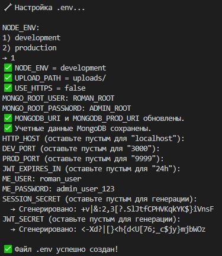

### 3. Выполняю команду `docker-compose down -v` для очистки и затем `docker-compose up -d mongo` для запуска базы данных `MongoDB`

### 4. Запускаю в терминале команду `npm run dev` (скрин ниже)

  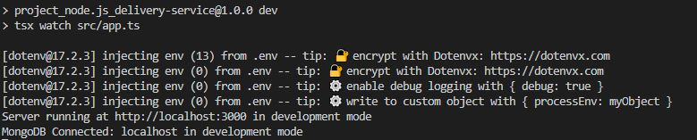

### 5. Запускаю `Postman` и тестирую api.

  +  **5.1. Регистрация**
     - Проверил регистрацию впервые и выполнил запрос, получив `status: 200 OK`. (Ниже скрин)

       |Key|Value|
       |--------|-----------|
       |Method|`POST`|
       |URL|`http://localhost:3000/api/signup`|
       |Headers|`Content-Type: application/json`|

       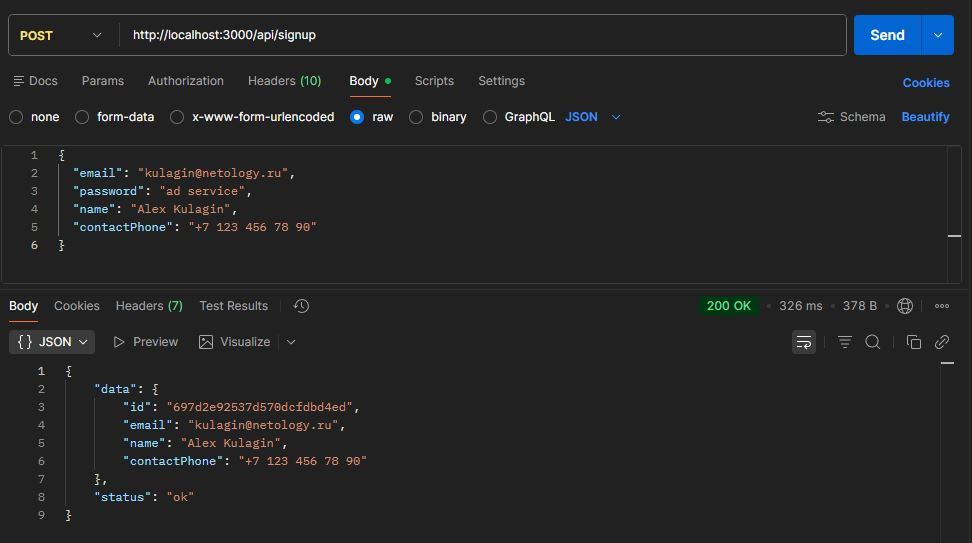

     - Проверил повторную регистрацию и выполнил запрос, получив `status: 400 Bad Request`. (Ниже скрин)

       |Key|Value|
       |--------|-----------|
       |Method|`POST`|
       |URL|`http://localhost:3000/api/signup`|
       |Headers|`Content-Type: application/json`|

       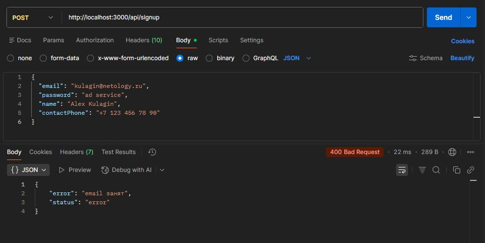

  + **5.2. Аутентификация**
    - Проверил аутентификацию с верными данными и выполнил запрос, получив `status: 200 OK`. Установилась сессия и куки. (Ниже скрин)

      |Key|Value|
      |--------|-----------|
      |Method|`POST`|
      |URL|`http://localhost:3000/api/signin`|
      |Headers|`Content-Type: application/json`|

      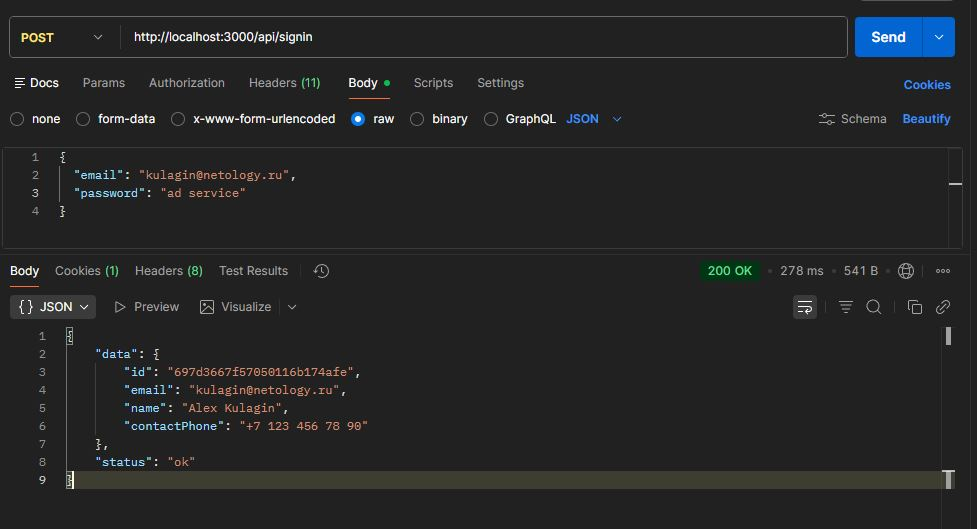

    - Проверил аутентификацию с неверными данными и выполнил запрос, получив `status: 400 Bad Request`. (Ниже скрин)

      |Key|Value|
      |--------|-----------|
      |Method|`POST`|
      |URL|`http://localhost:3000/api/signin`|
      |Headers|`Content-Type: application/json`|

      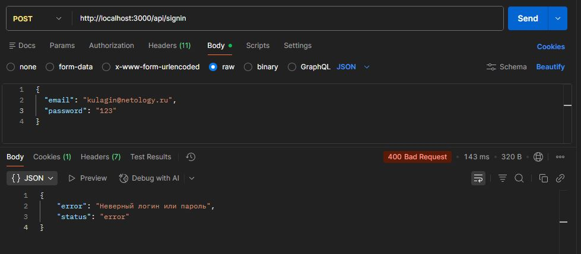

    - Проверил хеширование паролей при регистрации/аутентификации.

      

  + **5.3. Просмотр объявлений**
    - Проверил просмотр всего списка объявлений и выполнил запрос, получив `status: 200 OK`. (Ниже скрин)

        |Key|Value|
        |--------|-----------|
        |Method|`GET`|
        |URL|`http://localhost:3000/api/advertisements`|

        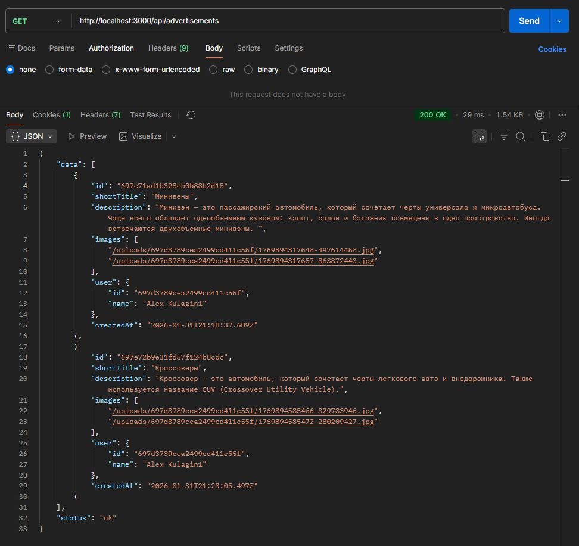

    - Проверил просмотр объявления по идентификатору и выполнил запрос, получив `status: 200 OK`. (Ниже скрин)

        |Key|Value|
        |--------|-----------|
        |Method|`GET`|
        |URL|`http://localhost:3000/api/advertisements/:id`|

        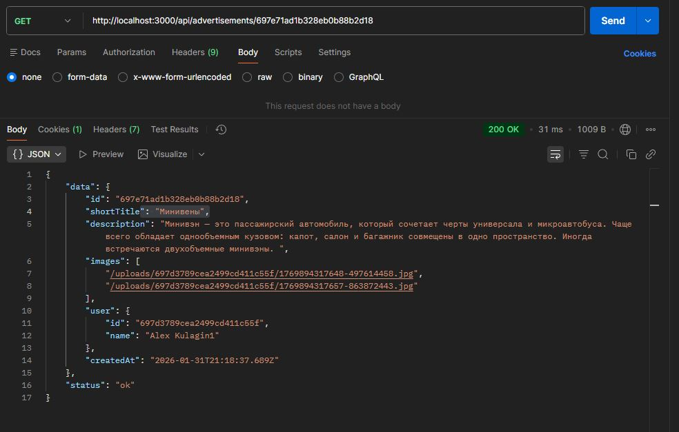

    - Проверил просмотр объявления по несуществующему идентификатору и выполнил запрос, получив `status: 400 Bad Request`. (Ниже скрин)

        |Key|Value|
        |--------|-----------|
        |Method|`GET`|
        |URL|`http://localhost:3000/api/advertisements/:id`|

        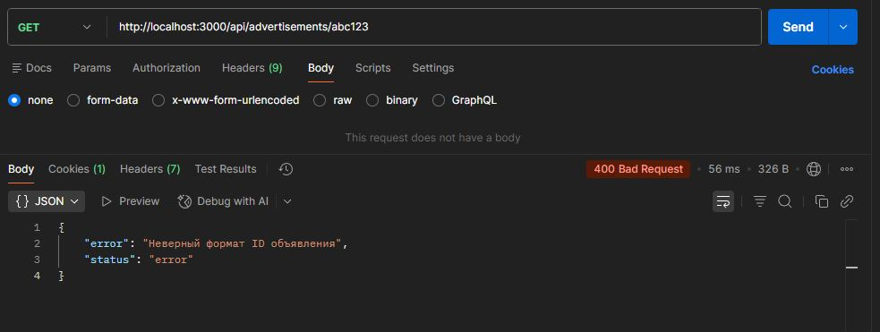

    - Проверил просмотр объявления по невалидному идентификатору и выполнил запрос, получив `status: 404 Not Found`. (Ниже скрин)

        |Key|Value|
        |--------|-----------|
        |Method|`GET`|
        |URL|`http://localhost:3000/api/advertisements/:id`|

        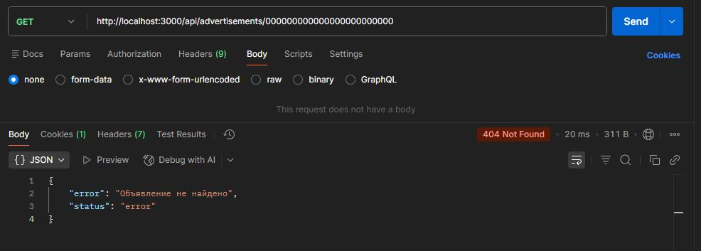

  + **5.3. Управление объявлениями**
    - Проверил добавление объявления после аутентификации и выполнил запрос, получив `status: 200 OK`. (Ниже скрин)

        |Key|Value|
        |--------|-----------|
        |Method|`POST`|
        |URL|`http://localhost:3000/api/advertisements`|

        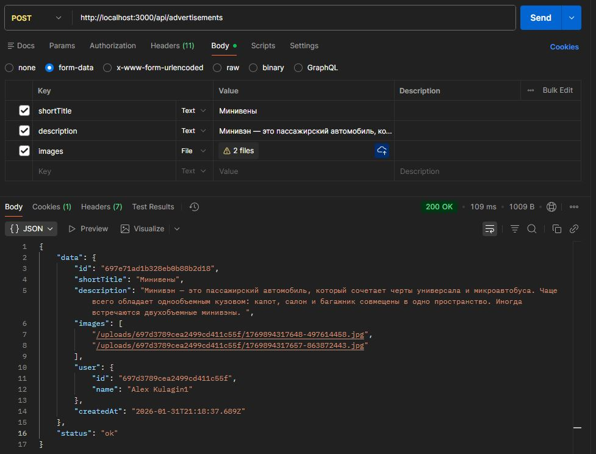

    - Проверил добавление объявления без аутентификации и выполнил запрос, получив `status: 401 Unauthorized`. (Ниже скрин)

        |Key|Value|
        |--------|-----------|
        |Method|`POST`|
        |URL|`http://localhost:3000/api/advertisements`|

        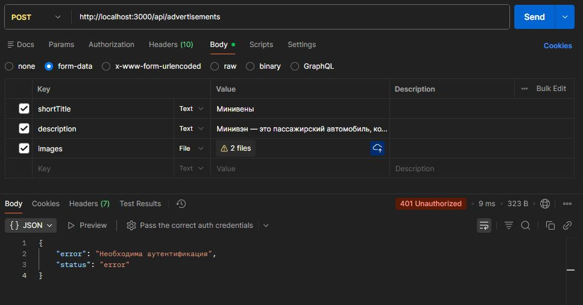

    - Проверил удаление объявления после аутентификации и выполнил запрос, получив `status: 200 OK`. (Ниже скрин)

        |Key|Value|
        |--------|-----------|
        |Method|`DELETE`|
        |URL|`http://localhost:3000/api/advertisements/:id`|

        

    - Проверил удаление объявления без аутентификации и выполнил запрос, получив `status: 401 Unauthorized`. (Ниже скрин)

        |Key|Value|
        |--------|-----------|
        |Method|`DELETE`|
        |URL|`http://localhost:3000/api/advertisements/:id`|

        

    - Проверил удаление объявления другим пользователем (после аутентификации) и выполнил запрос, получив `status: 403 Forbidden`. (Ниже скрин)

        |Key|Value|
        |--------|-----------|
        |Method|`DELETE`|
        |URL|`http://localhost:3000/api/advertisements/:id`|

        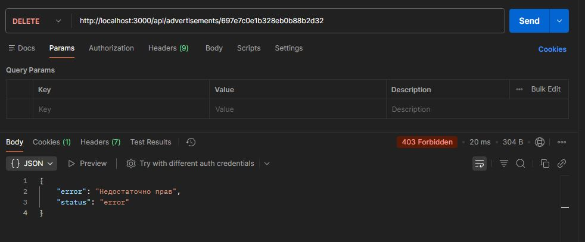

### 6. Общение
#### Открываю два разных браузера для удобного тестирования сокета, и там пишу URL: `http://localhost:3000/socket-test.html` и открываю страницу каждого браузера

  - Ввёл `email` и `password` первого и второго пользователя в разных браузерах. (Ниже скрин)

    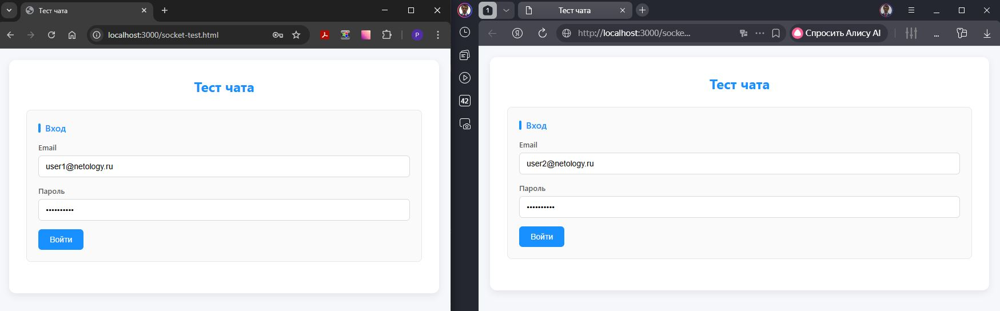

  - После успешной аутентификации подключился к чату. (Ниже скрин)

    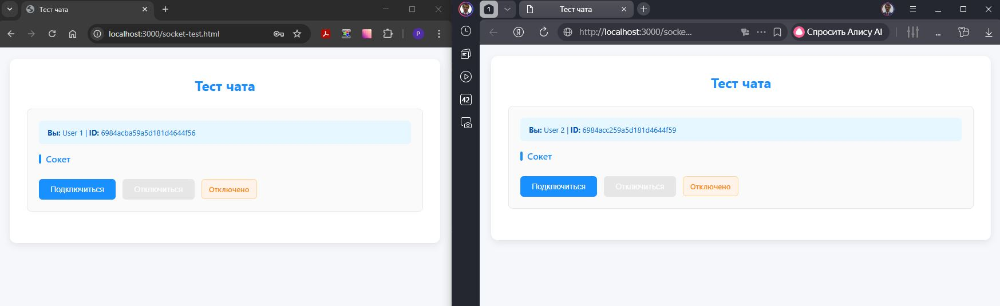

  - После успешного подключения к чату ввёл ID собеседника, чтобы написать ему. (Ниже скрин)

    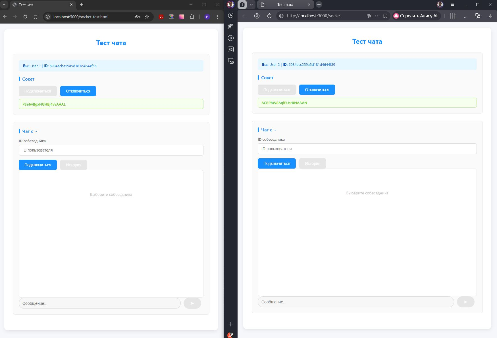

  - После этого начал диалог. (Ниже скрин)

    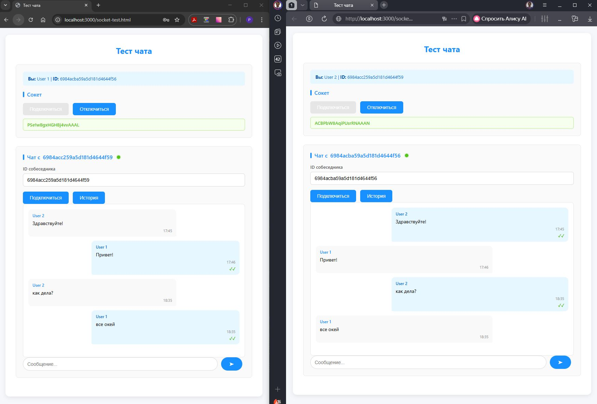